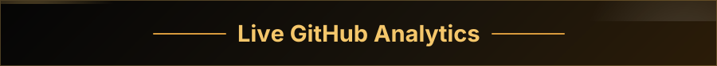

  

<strong>Hi, I'm Utkarsh Raturi 👋</strong>

I'm a <strong>Computer Science Engineering student and software developer</strong> focused on building products at the intersection of <strong>AI, full-stack development, and emerging technologies</strong>.

I enjoy turning ideas into working products, from <strong>AI agents and developer tools to intelligent platforms and research-driven projects</strong>. I'm currently sharpening my skills in <strong>DSA, system design, AI/ML, and cloud technologies</strong> while participating in hackathons and building real-world projects.

<strong>Full-Stack Developer | AI/ML Builder | Problem Solver | Product &amp; Hackathon Builder</strong>

<strong>Tech Stack</strong>

  &nbsp;
  &nbsp;
  &nbsp;
  &nbsp;
  &nbsp;
  &nbsp;
  &nbsp;
  &nbsp;
  &nbsp;
  &nbsp;
  &nbsp;
  &nbsp;
  &nbsp;
  &nbsp;
  

  

  
  

  

GitHub statistics and language cards are refreshed daily.

<strong>Connect With Me</strong>

  
  
  
  
  
  
  
  

Thanks for stopping by. Feel free to explore my repositories and connect.

