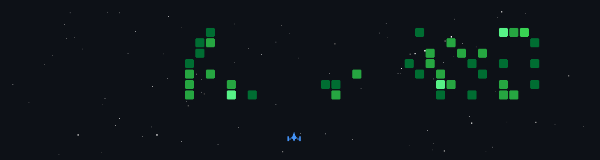

<p align="center">
  
</p>

```aura width=900 height=8 align=center
<div style={{ width: '100%', height: '100%', display: 'flex', alignItems: 'center', justifyContent: 'center', gap: 12 }}>
  <div style={{ flex: 1, height: 1, background: '#d99b3d' }} />
  <div style={{ width: 6, height: 6, background: '#f5c76b', transform: 'rotate(45deg)' }} />
  <div style={{ flex: 1, height: 1, background: '#d99b3d' }} />
</div>
```

<div align="center"><strong><span style="color: #f5c76b; font-size: 18px;">Hi, I'm Utkarsh Raturi</span></strong></div>
<br />

<p align="center">I'm a <strong>Computer Science Engineering student and software developer</strong> focused on building products at the intersection of <strong>AI, full-stack development, and emerging technologies</strong>.</p>

<p align="center">I enjoy turning ideas into working products, from <strong>AI agents and developer tools to intelligent platforms and research-driven projects</strong>. I'm currently sharpening my skills in <strong>DSA, system design, AI/ML, and cloud technologies</strong> while actively participating in hackathons and building real-world projects.</p>

<p align="center"><strong>Full-Stack Developer | AI/ML Builder | Problem Solver | Product & Hackathon Builder</strong></p>

<div align="center"><strong><span style="color: #f5c76b; font-size: 18px;">Tech Stack</span></strong></div>
<br />

```aura width=900 height=8 align=center
<div style={{ width: '100%', height: '100%', display: 'flex', alignItems: 'center', justifyContent: 'center', gap: 12 }}>
  <div style={{ flex: 1, height: 1, background: '#d99b3d' }} />
  <div style={{ width: 6, height: 6, background: '#f5c76b', transform: 'rotate(45deg)' }} />
  <div style={{ flex: 1, height: 1, background: '#d99b3d' }} />
</div>
```

<div align="center">
  &nbsp;
  &nbsp;
  &nbsp;
  &nbsp;
  &nbsp;
  &nbsp;
  &nbsp;
  &nbsp;
  &nbsp;
  &nbsp;
  &nbsp;
  &nbsp;
  &nbsp;
  &nbsp;
  
</div>

<p align="center">
  
</p>

```aura width=900 height=84 align=center
<div
  style={{
    width: '100%',
    height: '100%',
    display: 'flex',
    alignItems: 'center',
    justifyContent: 'center',
    position: 'relative',
    overflow: 'hidden',
    background: 'linear-gradient(135deg, #050505 0%, #18130b 58%, #2b1c08 100%)',
    border: '1px solid rgba(245,199,107,.30)',
    fontFamily: 'Inter',
  }}
>
  <div
    style={{
      position: 'absolute',
      width: 220,
      height: 220,
      borderRadius: 999,
      background: 'radial-gradient(circle, rgba(245,199,107,.34), rgba(245,199,107,0) 68%)',
      left: -70,
      top: -80,
    }}
  />
  <div
    style={{
      position: 'absolute',
      width: 260,
      height: 260,
      borderRadius: 999,
      background: 'radial-gradient(circle, rgba(255,255,255,.16), rgba(255,255,255,0) 70%)',
      right: -90,
      bottom: -120,
    }}
  />
  <div style={{ display: 'flex', alignItems: 'center', justifyContent: 'center', gap: 14, position: 'relative' }}>
    <div style={{ width: 92, height: 2, borderRadius: 99, background: '#d99b3d' }} />
    <div style={{ color: '#f5c76b', fontSize: 29, fontWeight: 900 }}>Live GitHub Analytics</div>
    <div style={{ width: 92, height: 2, borderRadius: 99, background: '#d99b3d' }} />
  </div>
</div>
```

<div align="center">
  
  
  <br /><br />
  
  <br /><br />
  
</div>

```aura width=900 height=8 align=center
<div style={{ width: '100%', height: '100%', display: 'flex', alignItems: 'center', justifyContent: 'center', gap: 12 }}>
  <div style={{ flex: 1, height: 1, background: '#d99b3d' }} />
  <div style={{ width: 6, height: 6, background: '#f5c76b', transform: 'rotate(45deg)' }} />
  <div style={{ flex: 1, height: 1, background: '#d99b3d' }} />
</div>
```

<div align="center"><strong><span style="color: #f5c76b; font-size: 18px;">Featured Projects</span></strong></div>
<br />

<table align="center">
  <thead>
    <tr>
      <th>Project</th>
      <th>Description</th>
      <th>Tech</th>
    </tr>
  </thead>
  <tbody>
    <tr>
      <td><code>Project One</code></td>
      <td>A short sentence about what it does and why it matters.</td>
      <td><code>React</code>, <code>Node.js</code></td>
    </tr>
    <tr>
      <td><code>Project Two</code></td>
      <td>A short sentence about the problem it solves.</td>
      <td><code>Python</code>, <code>API</code></td>
    </tr>
    <tr>
      <td><code>Project Three</code></td>
      <td>A short sentence about the result or impact.</td>
      <td><code>HTML</code>, <code>CSS</code>, <code>JavaScript</code></td>
    </tr>
  </tbody>
</table>

```aura width=900 height=8 align=center
<div style={{ width: '100%', height: '100%', display: 'flex', alignItems: 'center', justifyContent: 'center', gap: 12 }}>
  <div style={{ flex: 1, height: 1, background: '#d99b3d' }} />
  <div style={{ width: 6, height: 6, background: '#f5c76b', transform: 'rotate(45deg)' }} />
  <div style={{ flex: 1, height: 1, background: '#d99b3d' }} />
</div>
```

<div align="center"><strong><span style="color: #f5c76b; font-size: 18px;">Connect With Me</span></strong></div>
<br />

```aura width=150 height=44 link="https://github.com/NexVed" inline align=center
<SocialMediaButton icon="https://cdn.simpleicons.org/github/FFFFFF" text="GitHub" width={150} height={44} backgroundColor="#0b0b0b" />
```
```aura width=150 height=44 link="https://www.linkedin.com/in/utkarsh-raturi-33b616188/" inline align=center
<SocialMediaButton icon="https://www.readmecodegen.com/api/social-icon?name=linkedin&amp;color=ffffff" text="LinkedIn" width={150} height={44} backgroundColor="#a66a1f" />
```
```aura width=150 height=44 link="https://www.reddit.com/user/Asleep-Count3999/" inline align=center
<SocialMediaButton icon="https://cdn.simpleicons.org/reddit/FFFFFF" text="Reddit" width={150} height={44} backgroundColor="#c46b2d" />
```
```aura width=150 height=44 link="https://x.com/UtkarshRaturi24" inline align=center
<SocialMediaButton icon="https://cdn.simpleicons.org/x/FFFFFF" text="X" width={150} height={44} backgroundColor="#111111" />
```
```aura width=150 height=44 link="https://stackoverflow.com/users/16839403/utkarsh-raturi" inline align=center
<SocialMediaButton icon="https://cdn.simpleicons.org/stackoverflow/FFFFFF" text="Stack Overflow" width={150} height={44} backgroundColor="#a66a1f" />
```
```aura width=150 height=44 link="https://www.hackerrank.com/profile/u9780567022r" inline align=center
<SocialMediaButton icon="https://cdn.simpleicons.org/hackerrank/FFFFFF" text="HackerRank" width={150} height={44} backgroundColor="#477a3c" />
```
```aura width=150 height=44 link="https://leetcode.com/u/u9780567022r/" inline align=center
<SocialMediaButton icon="https://cdn.simpleicons.org/leetcode/FFFFFF" text="LeetCode" width={150} height={44} backgroundColor="#b07a2f" />
```
```aura width=150 height=44 link="https://www.geeksforgeeks.org/profile/u9780567022r" inline align=center
<SocialMediaButton icon="https://cdn.simpleicons.org/geeksforgeeks/FFFFFF" text="GeeksforGeeks" width={150} height={44} backgroundColor="#3f6f4a" />
```

```aura width=900 height=8 align=center
<div style={{ width: '100%', height: '100%', display: 'flex', alignItems: 'center', justifyContent: 'center', gap: 12 }}>
  <div style={{ flex: 1, height: 1, background: '#d99b3d' }} />
  <div style={{ width: 6, height: 6, background: '#f5c76b', transform: 'rotate(45deg)' }} />
  <div style={{ flex: 1, height: 1, background: '#d99b3d' }} />
</div>
```

<p align="center">Thanks for stopping by. Feel free to explore my repositories and connect.</p>
